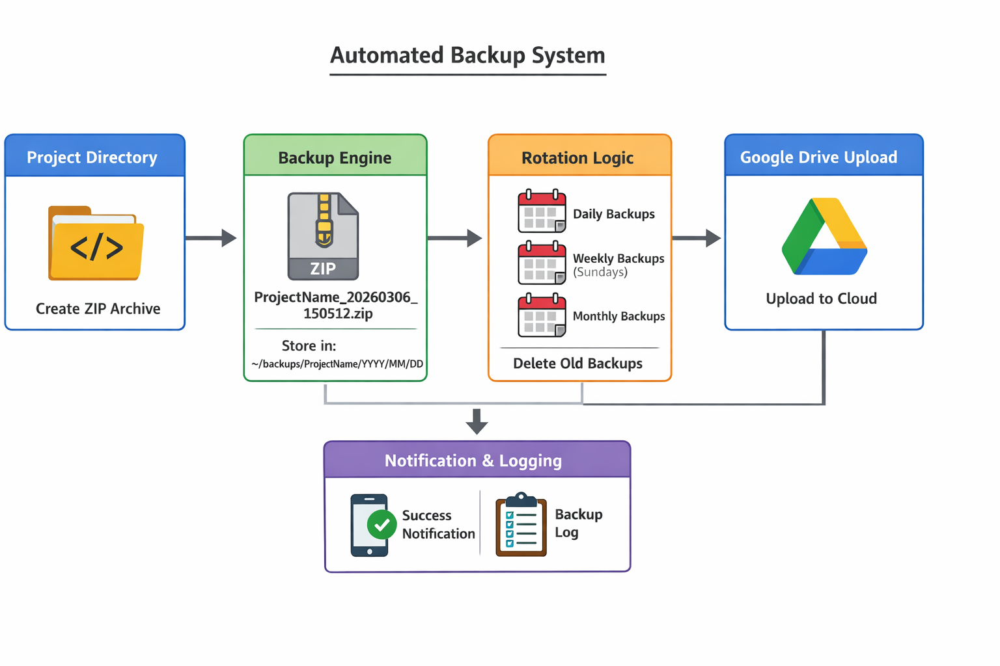
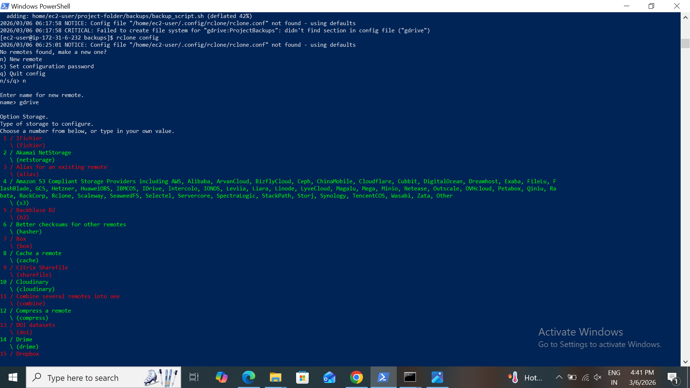
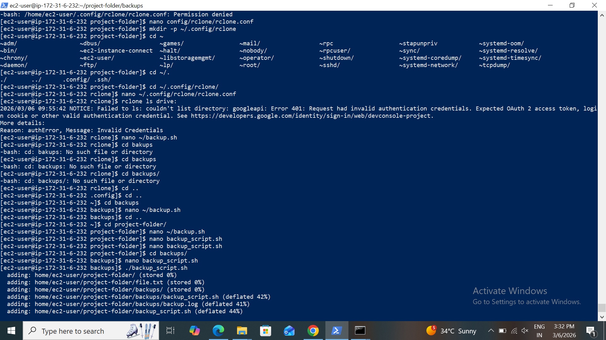
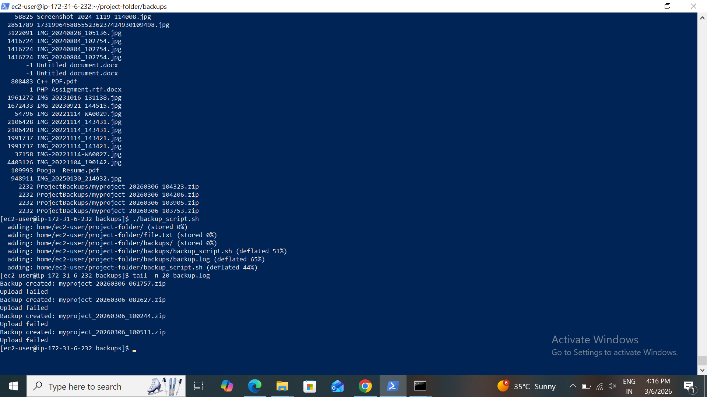
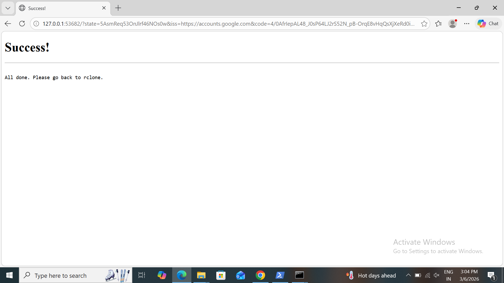

# Automated Backup and Rotation Script with Google Drive Integration

This project provides a fully automated backup solution for your projects. It supports timestamped backups, rotational retention (daily, weekly, monthly), Google Drive integration, logging, and cURL notifications.

## Architecture Overview

The Automated Backup System provides reliable, scheduled, and rotational backups with cloud integration.

## Components

### 1. Backup Engine

- Creates timestamped .zip archives of the project directory

- Stores backups in structured folders: ~/backups/ProjectName/YYYY/MM/DD/

### 2. Rotation & Retention Logic

- Implements rotational strategy:

- Daily: keep last X days

- Weekly: keep last X weeks (Sundays)

- Monthly: keep last X months

### 3. Automatically deletes older backups beyond retention

- Google Drive Integration & Notifications

- Uploads backups using rclone CLI

- Maintains backup.log for auditing

      [Project Directory] 
        │
        ▼
      [Backup Engine] ──> Creates ZIP ──>  Stores in ~/backups/ProjectName/YYYY/MM/DD/
        │
        ▼
      [Rotation Logic] ──> Deletes old backups (daily/weekly/monthly)
        │
        ▼
      [Google Drive Upload] ──> Uploads backup via rclone
        │
        ▼
      [Logging] ──>  logs all actions

## Installation & Setup

### 1. Install Curl

      sudo yum install curl -y

### 2. Install rclone

    curl https://rclone.org/install.sh | sudo bash

### 3. Configure Google Drive

     rclone config
     # Follow the prompts to create a remote named 'gdrive'

- Create a folder in Google Drive for backups, e.g., BackupFolderName.

### 4. Make the script executable

      chmod +x backup_script.sh

## Configuration

You can configure the script at the top of backup_script.sh or via a .env/config.json file.

Sample configuration variables:

    PROJECT_DIR=~/myproject
    PROJECT_NAME=MyProject
    BACKUP_PATH=~/backups/$PROJECT_NAME

    # Rotation settings
    DAILY_KEEP=7
    WEEKLY_KEEP=4
    MONTHLY_KEEP=3

    # Google Drive
    GDRIVE_REMOTE=gdrive
    GDRIVE_FOLDER=BackupFolderName

    
### backup_script.sh

     #!/bin/bash

    # ================================
    # Automated Backup Script
    # ================================

    # CONFIGURATION
    PROJECT_DIR="${PROJECT_DIR:-$HOME/myproject}"       # Directory to backup
    PROJECT_NAME="${PROJECT_NAME:-MyProject} 
     # Project name
     BACKUP_PATH="${BACKUP_PATH:-$HOME/backups/$PROJECT_NAME}"  # Local backup storage
     DAILY_KEEP="${DAILY_KEEP:-7}"                       # Keep last X daily backups
     WEEKLY_KEEP="${WEEKLY_KEEP:-4}"                     # Keep last X weekly backups (Sundays)
     MONTHLY_KEEP="${MONTHLY_KEEP:-3}"                   # Keep last X monthly backups
     GDRIVE_REMOTE="${GDRIVE_REMOTE:-gdrive}"           # rclone remote name
     GDRIVE_FOLDER="${GDRIVE_FOLDER:-BackupFolderName}" # Google Drive folder
     NOTIFY_URL="${NOTIFY_URL:-}"                        # Webhook URL
     DISABLE_NOTIFY="${DISABLE_NOTIFY:-false}"           # Disable notification

     # LOG FILE
     LOG_FILE="$BACKUP_PATH/backup.log"
     mkdir -p "$BACKUP_PATH"

     # TIMESTAMP
     TIMESTAMP=$(date +%Y%m%d_%H%M%S)
      BACKUP_NAME="${PROJECT_NAME}_${TIMESTAMP}.zip"
      BACKUP_DIR="$BACKUP_PATH/$(date +%Y)/$(date +%m)/$(date +%d)"
      mkdir -p "$BACKUP_DIR"

     # ========================================
     # 1. Create Backup
     # ========================================
     zip -r "$BACKUP_DIR/$BACKUP_NAME" "$PROJECT_DIR" > /dev/null 2>&1
     if [ $? -eq 0 ]; then
       echo "$(date '+%Y-%m-%d %H:%M:%S') -  Backup created: $BACKUP_NAME" | tee -a "$LOG_FILE"
     else
        echo "$(date '+%Y-%m-%d %H:%M:%S') - Backup failed!" | tee -a "$LOG_FILE"
      exit 1
     fi

      # ========================================
     # 2. Upload to Google Drive
     # ========================================
     rclone copy "$BACKUP_DIR/$BACKUP_NAME" "$GDRIVE_REMOTE:$GDRIVE_FOLDER" --progress > /dev/null 2>&1
     if [ $? -eq 0 ]; then
       echo "$(date '+%Y-%m-%d %H:%M:%S') - Uploaded to Google Drive: Success" | tee -a "$LOG_FILE"
     else
       echo "$(date '+%Y-%m-%d %H:%M:%S') - Google Drive upload failed!" | tee -a "$LOG_FILE"
     fi

     # ========================================
     # 3. Rotation: Delete old backups
     # ========================================
     # Daily rotation
     find "$BACKUP_PATH" -type f -name "${PROJECT_NAME}_*.zip" -mtime +$DAILY_KEEP -exec rm -f {} \;
     # Weekly rotation (keep last WEEKLY_KEEP Sundays)
     find "$BACKUP_PATH" -type f -name "${PROJECT_NAME}_*.zip" -daystart -mtime +$((WEEKLY_KEEP*7)) -exec rm -f {} \;

     
### Usage

Run the backup script:

        ./backup_script.sh

## Output

### Browse Sign In

### Rclone Drive

### Log
All operations are logged in backup.log:

### Browser

### ✅ How It Works

- Creates a timestamped ZIP of your project directory.

- Stores backups in ~/backups/ProjectName/YYYY/MM/DD/.

- Uploads to Google Drive via rclone.

- Deletes old backups based on rotation policy:

- Daily: keep last 7

- Weekly: keep last 4 (Sundays)

- Monthly: keep last 3 months

- Logs all actions in backup.log.

## Conclusion

This project demonstrates a robust automated backup solution:

- Reliable timestamped backups prevent data loss

- Efficient storage management with rotation policies

- Seamless Google Drive integration for offsite storage

- Automated notifications ensure visibility of backup status

## Author

mansikadam

Email : mansikadam1100@gmail.com

Github: https://github.com/mansikadam1100

